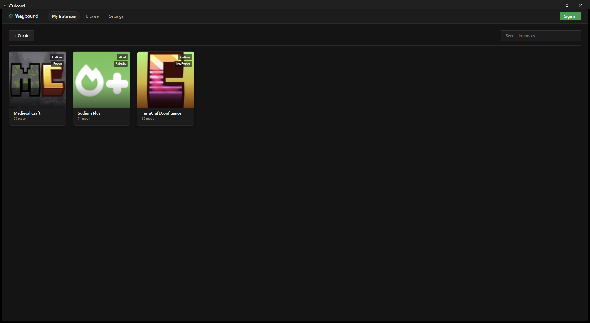
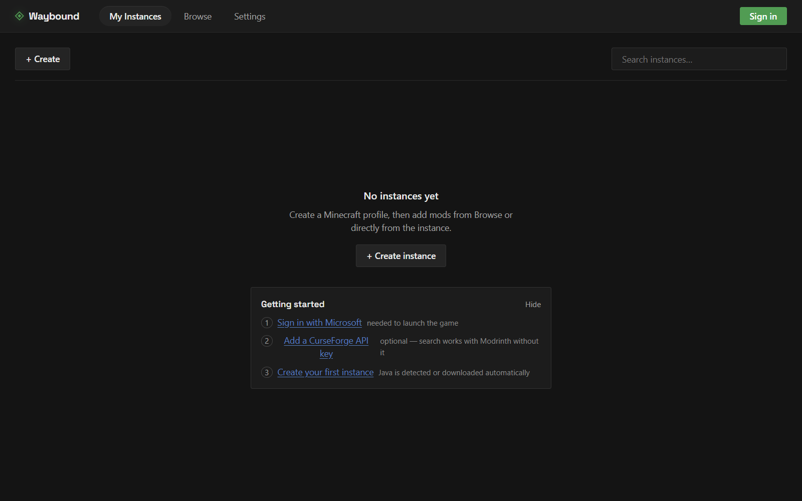
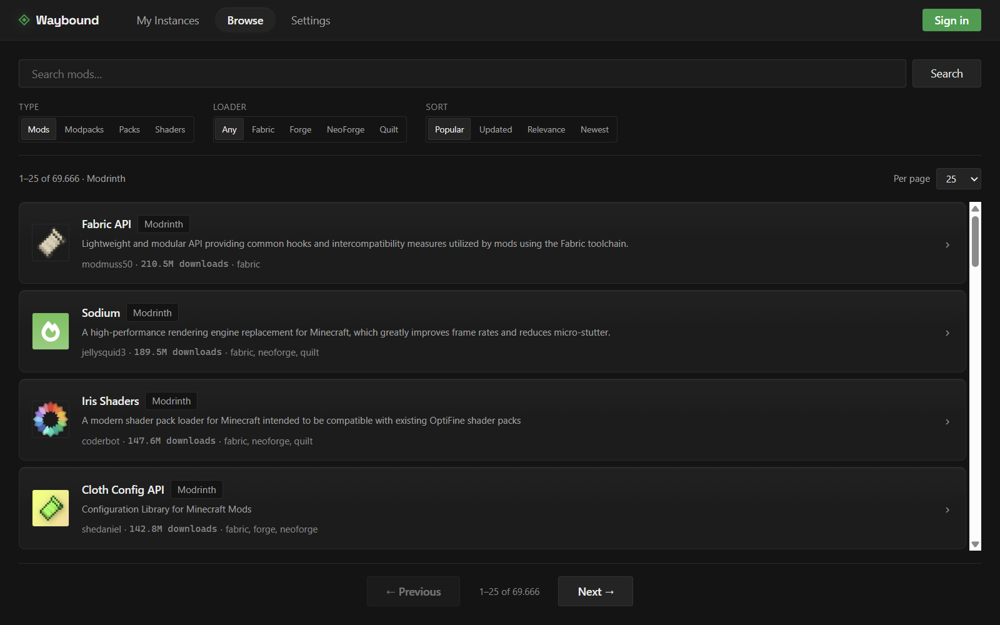
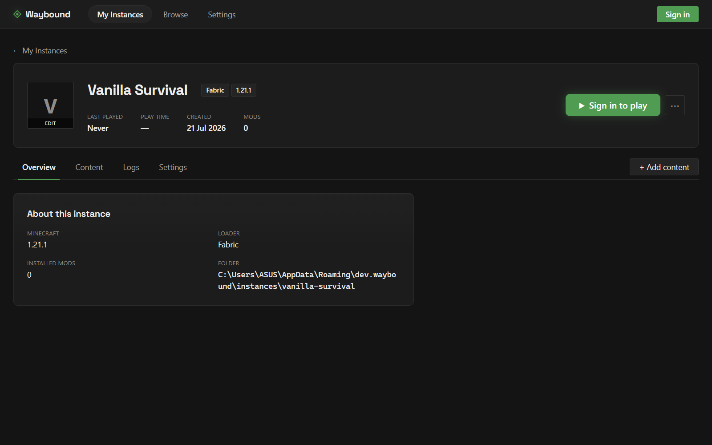

# Waybound

Native Minecraft mod manager **and launcher** — a CurseForge + Modrinth client
built with Tauri v2 and React 19. Browse and install mods, modpacks, resource
packs, and shaders; manage instances; pre-edit `options.txt`; and launch the
game.

> Waybound is not affiliated with Mojang, Microsoft, CurseForge, or Modrinth.
> Minecraft is a trademark of Mojang Synergies AB. You must own Minecraft:
> Java Edition to play.

**Platform support: Windows only** for now. The code may build on other
platforms but has never been tested there.



<details>
<summary>More screenshots (blank state, Browse, instance detail)</summary>

|                     Blank state                     |                       Browse                       |                     Instance detail                     |
| :--------------------------------------------------: | :-------------------------------------------------: | :--------------------------------------------------: |
|  |  |  |

</details>

## Install

Download the latest installer from the
[Releases](../../releases) page, or build from source (see
[Development](#development)).

## Playing the game

Waybound can launch **Vanilla**, **Fabric**, **Forge**, and **NeoForge**
instances directly:

1. **Sign in** with your Microsoft account (top-right, or Settings → Account &
   Launch). No setup or registration needed — see
   [`docs/microsoft-auth.md`](docs/microsoft-auth.md). Waybound never sees your
   password; you approve access on Microsoft's page via the device-code flow.
2. Open an instance and press **Play**. On first launch Waybound downloads and
   verifies the client, libraries, natives, and assets from Mojang, then starts
   Java with the correct classpath and arguments.

**Java is automatic.** Waybound auto-detects installed JDKs, and if none matches
a version's requirement it **downloads the correct Mojang Java runtime** for you
(Java 8 for ≤1.16 up to Java 25 for the latest) — no manual JDK install needed.
Override the Java path or max memory in Settings → Account & Launch.

Shared game files live in `%APPDATA%\dev.waybound\minecraft`; per-instance
game directories live under `%APPDATA%\dev.waybound\instances`.

## Known limitations

- **Quilt instances cannot be launched yet** — installing mods for them works,
  but only Vanilla, Fabric, Forge, and NeoForge launch. Use the official
  launcher for Quilt in the meantime.
- Microsoft sign-in uses the device-code flow with the public Xbox Live client
  ID used by the official launcher; see
  [`docs/microsoft-auth.md`](docs/microsoft-auth.md) for details and caveats.

## Configuration

CurseForge requires an API key: per CurseForge's API terms, each user must
obtain their own. Open **Settings** in the app and paste a key from
[console.curseforge.com](https://console.curseforge.com/). Modrinth needs no
key.

The key and your Microsoft sign-in tokens are stored **encrypted with Windows
DPAPI** (bound to your Windows user account) in
`%APPDATA%\dev.waybound\config.toml` — the file is unreadable if copied to
another machine or user. Nothing sensitive ever leaves your machine. Search
cache and mod identity mappings live in `%APPDATA%\dev.waybound\library.db`.

## Development

```bash
npm install
npm run tauri dev
```

Frontend-only (no Rust rebuild): `npm run dev`. Rust checks/tests:
`cargo check` / `cargo test` in `src-tauri/`.

## Build

```bash
npm run tauri build
```

## License

[GPL-3.0](LICENSE)
