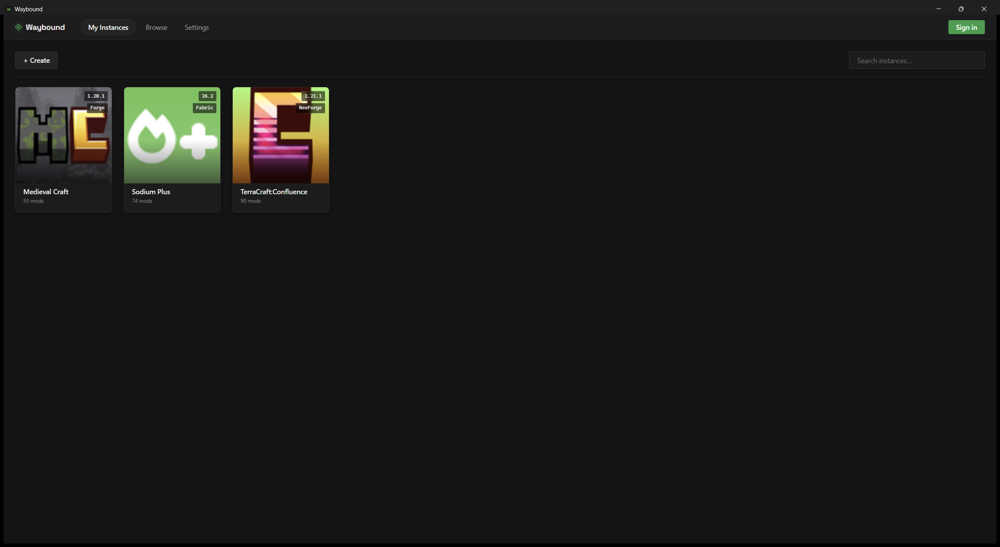
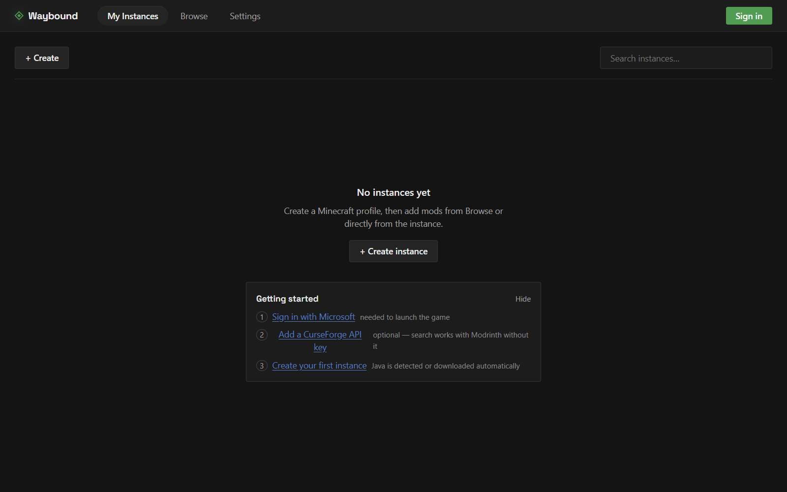
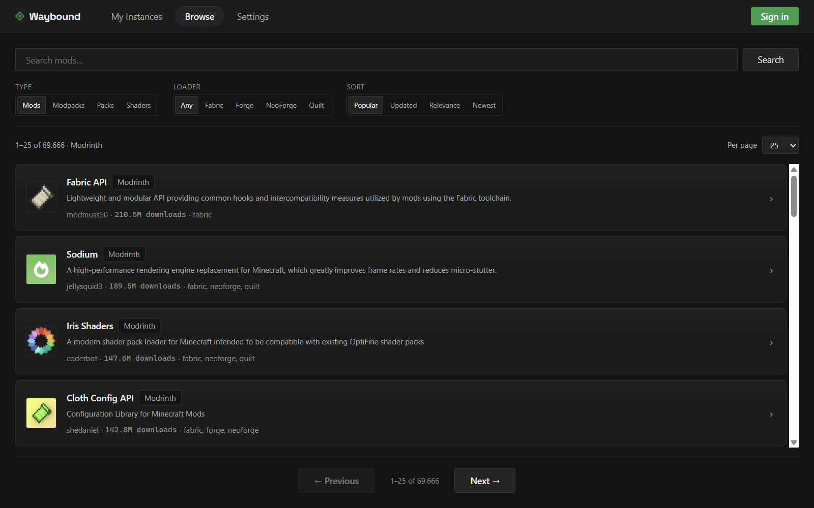
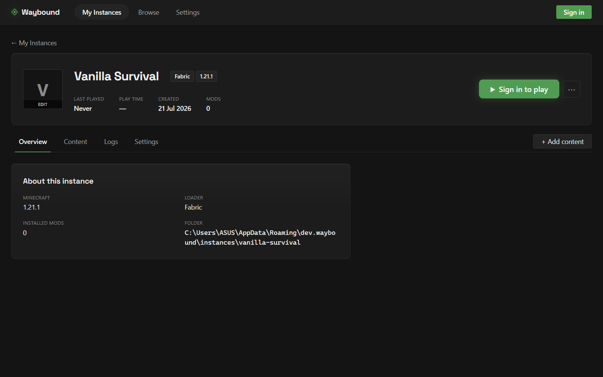
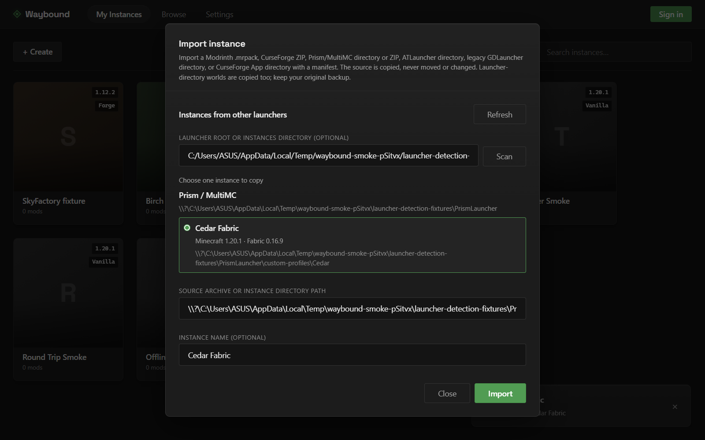

# Waybound

Native Minecraft mod manager **and launcher** — a CurseForge + Modrinth client
built with Tauri v2 and React 19. Browse and install mods, modpacks, resource
packs, and shaders; manage instances; pre-edit `options.txt`; and launch the
game.

> Waybound is not affiliated with Mojang, Microsoft, CurseForge, or Modrinth.
> Minecraft is a trademark of Mojang Synergies AB. You must own Minecraft:
> Java Edition to play.

**Platform support: Windows only** for now. The code may build on other
platforms but has never been tested there.



<details>
<summary>More screenshots (blank state, Browse, instance detail, import from launchers)</summary>

|                     Blank state                     |                       Browse                       |                     Instance detail                     |                Import from launchers                |
| :--------------------------------------------------: | :-------------------------------------------------: | :--------------------------------------------------: | :--------------------------------------------------: |
|  |  |  |  |

</details>

## Install

Download the latest installer from the
[Releases](../../releases) page, or build from source (see
[Development](#development)).

## Playing the game

Waybound supports launch preparation for **Vanilla**, **Fabric**, **Quilt**,
**Forge**, and **NeoForge** instances:

1. **Sign in** with your Microsoft account (top-right, or Settings → Account &
   Launch). No setup or registration needed — see
   [`docs/microsoft-auth.md`](docs/microsoft-auth.md). Waybound never sees your
   password; you approve access on Microsoft's page via the device-code flow.
2. Open an instance and press **Play**. On first launch Waybound downloads and
   verifies the client, libraries, natives, and assets from Mojang, then starts
   Java with the correct classpath and arguments.

**Java is automatic.** Waybound auto-detects installed JDKs, and if none matches
a version's requirement it **downloads the correct Mojang Java runtime** for you
(Java 8 for ≤1.16 up to Java 25 for the latest) — no manual JDK install needed.
Override the Java path or max memory in Settings → Account & Launch.

Shared game files live in `%APPDATA%\dev.waybound\minecraft`; per-instance
game directories live under `%APPDATA%\dev.waybound\instances`.

### Offline use

Saved instances remain visible when version discovery fails. Previously known
Minecraft versions remain available for instance creation after restart.
Launch preparation reuses cached version/loader metadata and installed files.
Prepare the instance online once first: older installations may have game JARs
but lack the metadata needed offline. First-time sign-in still needs a network;
offline account fallback requires a previously authenticated, saved account.

### Import and export

Open **Import** on My Instances to scan default launcher locations. Select an
instance from the grouped list, then choose **Import**. For portable launchers
or custom storage, enter a launcher root or instances directory and press
**Scan**. Prism/MultiMC `InstanceDir` settings are honored.

Directory import supports Prism/MultiMC, ATLauncher, legacy GDLauncher
(`config.json` loader metadata, not Carbon), and CurseForge App instances with
an embedded pack manifest. Manual `.mrpack`, CurseForge modpack ZIP, and
Prism/MultiMC exported ZIP imports remain available below the detected list.
Imports copy into a new instance; source files and worlds stay unchanged.
Launcher-directory worlds are copied too; keep your original backup.
Custom Prism patches and unknown loaders are rejected rather than silently
discarded. CurseForge ZIPs with remote files require an API key;
incomplete/manual-download imports are not published as finished instances.

Discovery follows Modrinth's fixed-root and metadata-validation approach
([reference implementation](https://github.com/modrinth/code/blob/7a2f697e6769b414bac544dc32b1a8430342493d/packages/app-lib/src/api/pack/import/mod.rs),
reviewed 2026-09-17), not a full-drive or installed-program scan.

Use an instance's **Export** action to create `.mrpack`. This is a shareable
modpack, not a world/account backup. Binary files need exact Modrinth matches
or verified imported download provenance; unresolved binaries cause an error
rather than being bundled or omitted. Existing export files are not overwritten.

Install notifications provide pause/resume/cancel controls. Progress uses file
counts; no estimated time is shown when it cannot be calculated reliably.

## Known limitations

- Offline game execution and the Quilt game runtime still need end-to-end
  verification with an authenticated account and complete installed files;
  cached preparation is covered by deterministic regression tests.
- Microsoft sign-in uses the device-code flow with the public Xbox Live client
  ID used by the official launcher; see
  [`docs/microsoft-auth.md`](docs/microsoft-auth.md) for details and caveats.

## Configuration

CurseForge requires an API key: per CurseForge's API terms, each user must
obtain their own. Open **Settings** in the app and paste a key from
[console.curseforge.com](https://console.curseforge.com/). Modrinth needs no
key.

The key and your Microsoft sign-in tokens are stored **encrypted with Windows
DPAPI** (bound to your Windows user account) in
`%APPDATA%\dev.waybound\config.toml` — encrypted secrets are bound to your
Windows user account. Authentication tokens are sent to the relevant services
when signing in or refreshing access. Search cache and mod identity mappings
live in `%APPDATA%\dev.waybound\library.db`.

## Development

```bash
npm install
npm run tauri dev
```

Frontend-only (no Rust rebuild): `npm run dev`. Rust checks/tests:
`cargo check` / `cargo test` in `src-tauri/`.

## Build

```bash
npm run tauri build
```

## License

[GPL-3.0](LICENSE)
